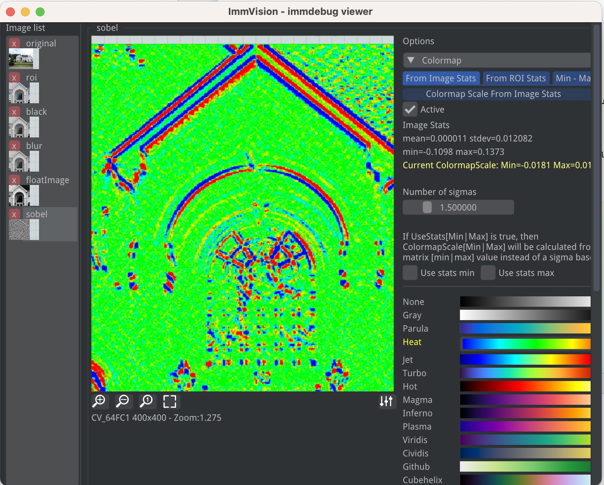
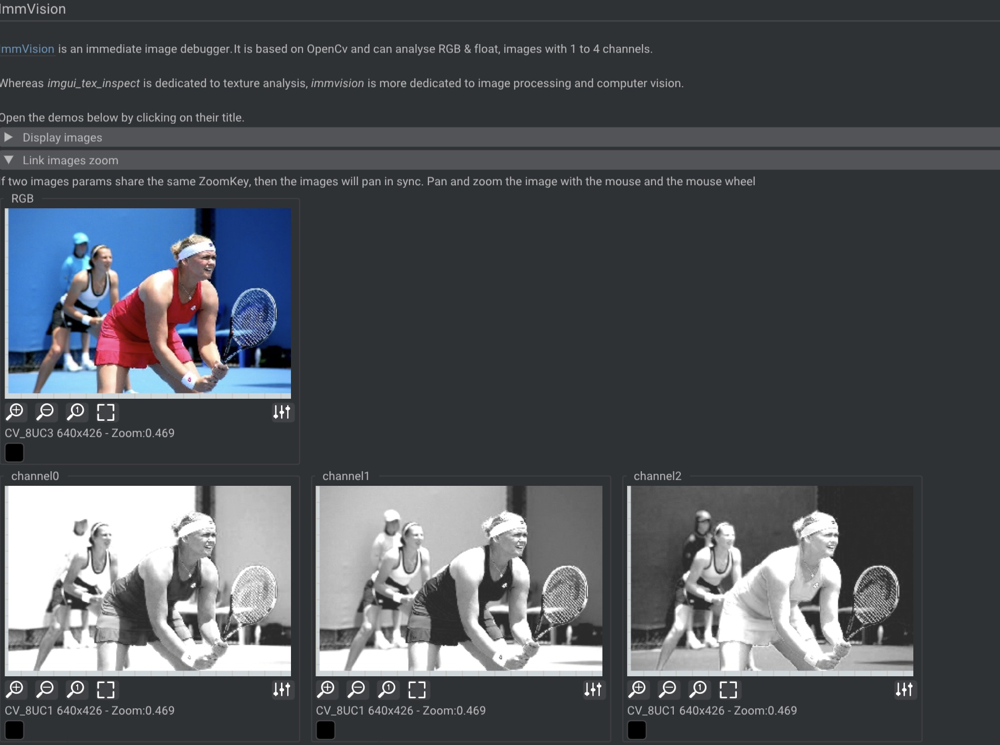

# ImmVision

ImmVision (a.k.a Immediate Vision) provides two tools for working with images:

- **ImmDebug** — a standalone image debugger for any C++ or Python process
- **ImmVision viewer** — an image viewer/analyzer widget for [ImGui](https://github.com/ocornut/imgui) applications

> **v1.92.601**: OpenCV is now fully optional. ImmVision works standalone with its own `ImageBuffer` type. See [CHANGELOG.md](CHANGELOG.md) for details.


## ImmDebug — Visual Image Debugger

[Video tutorial on Youtube](https://www.youtube.com/watch?v=ztVBk2FN6_8)

ImmDebug lets you visually inspect images from any running program — during execution or even after it finishes (post-mortem). Just add one-line calls to send images to a standalone viewer with zoom, pan, pixel inspection, and colormaps.



### Python

Install from PyPI (includes both the client and the viewer):

```bash
pip install immdebug
```

**1. Start the viewer** (in a terminal):

```bash
immdebug-viewer
```

**2. Send images** (from your code, a script, a notebook, ...):

```python
import numpy as np
from immdebug import immdebug

image = np.random.randint(0, 255, (480, 640, 3), dtype=np.uint8)
immdebug(image, "random noise")
```

**Example with OpenCV:**

```python
import cv2
from immdebug import immdebug, immdebug_bgr

image = cv2.imread("photo.jpg")
immdebug_bgr(image, "original")  # BGR image from OpenCV

gray = cv2.cvtColor(image, cv2.COLOR_BGR2GRAY)
immdebug(gray, "grayscale")
```

See the [immdebug Python package](immdebug_python/) for the full API documentation.

### C++

#### Step 1: compile immdebug_viewer

```bash
git clone https://github.com/pthom/immvision.git
mkdir build && cd build
cmake .. -DCMAKE_BUILD_TYPE=Release
make -j
```

Optionally, copy `bin/immdebug_viewer` somewhere in your PATH.

Then, launch the viewer, so that it receives and displays images sent from your code.


#### Step 2: add immdebug to your project

Simply drop the content of [src/immdebug](src/immdebug) into your project.

```cpp
#include "immdebug/immdebug.h"
#include "immvision/image.h"  // for ImRead

void ProcessImage()
{
    auto image = ImmVision::ImRead("photo.jpg");  // returns RGB
    ImmVision::ImmDebug(image, "original");

    // ImmDebugBgr is available for images in BGR order (e.g. from OpenCV)
}
```

<details>
<summary>C++ API</summary>

```cpp
namespace ImmVision
{
    // Send an RGB image to the viewer
    void ImmDebug(
        const ImageBuffer & image,
        const std::string & legend = "",
        const Point2d & zoomCenter = Point2d(),
        double zoomRatio = -1.,
        const std::string& zoomKey = "",
        const std::string& colorAdjustmentsKey = ""
    );

    // Send a BGR image to the viewer (OpenCV users)
    void ImmDebugBgr(
        const ImageBuffer & image,
        const std::string & legend = "",
        const Point2d & zoomCenter = Point2d(),
        double zoomRatio = -1.,
        const std::string& zoomKey = "",
        const std::string& colorAdjustmentsKey = ""
    );
}
```
</details>

### ImmDebug features

- **Non-blocking**: just writes a file and returns immediately
- **Cross-language**: C++ and Python clients use the same binary format and work with either viewer
- **Single instance**: re-launching the viewer brings the existing instance to the top
- **Post-mortem**: images persist in `<temp_directory>/ImmDebug/` for 1 hour — start the viewer after your script finishes
- **Auto cleanup**: old images are cleaned automatically


## ImmVision — Image Viewer Widget for ImGui

[Video tutorial on YouTube](https://youtu.be/nuJW21-BCkE)

ImmVision provides an image viewer widget for applications built with [ImGui](https://github.com/ocornut/imgui). It supports zoom, pan, pixel value inspection, colormaps, linked views, and more.

This widget is included in [Dear ImGui Bundle](https://github.com/pthom/imgui_bundle), where it can be used from both C++ and Python.

See [online demo!](https://imgui-bundle.pages.dev/explorer/demo_immvision_launcher.html)



### C++ API

```cpp
IMMVISION_API void Image(const std::string& label, const ImageBuffer& image, ImageParams* params);
IMMVISION_API void ImageDisplay(const std::string& label, const ImageBuffer& image, const ImageParams& params);

IMMVISION_API void Inspector_AddImage(const ImageBuffer& image, const std::string& legend, ...);
IMMVISION_API void Inspector_Show();
```

See [Full API](src/immvision/image.h)

### Creating an ImageBuffer

`ImageBuffer` is ImmVision's lightweight image container. No OpenCV required.

**From a raw pointer** (non-owning view — works with any image source):

```cpp
// stb_image
int w, h, ch;
unsigned char* pixels = stbi_load("photo.jpg", &w, &h, &ch, 0);
ImmVision::Image("photo", ImmVision::ImageBuffer(pixels, w, h, ch), &params);
stbi_image_free(pixels);

// SDL_Surface
ImmVision::ImageBuffer(surface->pixels, surface->w, surface->h, 4,
                        ImmVision::ImageDepth::uint8, surface->pitch);

// Any buffer with known dimensions
ImmVision::ImageBuffer(my_data, width, height, channels);
```

**From ImmVision's built-in reader** (uses stb_image, returns RGB):

```cpp
ImmVision::ImageBuffer image = ImmVision::ImRead("photo.jpg");
```

**From OpenCV** (zero-copy, requires `IMMVISION_HAS_OPENCV`):

```cpp
cv::Mat mat = cv::imread("photo.jpg");
ImmVision::Image("photo", mat, &params);  // implicit conversion
```

**Owning allocation:**

```cpp
ImmVision::ImageBuffer image = ImmVision::ImageBuffer::Zeros(640, 480, 3, ImmVision::ImageDepth::uint8);
```

### Python (via Dear ImGui Bundle)

```python
from imgui_bundle import immvision

# Pass numpy arrays directly
immvision.image("My Image", my_array, params)
immvision.inspector_add_image(my_array, "label")
immvision.inspector_show()
```

See [Dear ImGui Bundle documentation](https://imgui-bundle.pages.dev/) for setup and usage.


---

## Changelog

See [CHANGELOG.md](CHANGELOG.md) for the full history.
